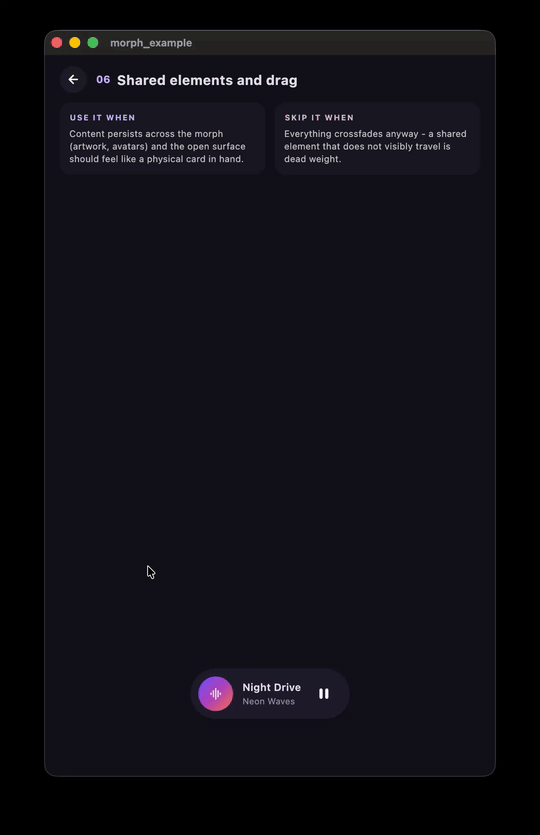

# morph

Identity-based, spring-driven, interruptible widget-to-overlay morphs
for Flutter, plus a liquid skin that fuses nearby surfaces into one
organic shape. No Navigator coupling.

<!-- hero.gif: the Card to page scene - the mini player morphs into
     the full card, artwork travelling as a shared element. -->


> I build this for an app of mine, and the API develops in whatever
> direction that app needs. There is no pub.dev release; versions are
> GitHub tags following semver. If you build on it, pin a tag.

## Start with the example

A guided tour: seven scenes, each an app mockup in a phone frame
answering one question (the compose button that becomes its dialog,
the library card that becomes a real page, the dock whose selection
is mass), the last one a sandbox playground. Live build:
<https://tembeon.github.io/morph/> (wasm - a native release build runs
far smoother). API docs live next to it:
<https://tembeon.github.io/morph/docs/>.

```bash
cd example
flutter run -d macos   # or any device
```

Recipes and applied patterns live there, not in this README.

## Two layers, Flutter-style

- `package:morph/foundation.dart` - the engine: identity, flights,
  retargeting, the liquid skin. No opinions.
- `package:morph/widgets.dart` - opinionated widgets built on it:
  `showMorphMenu` (a control becomes its own menu), the `Tug` glass
  tether, `SpringButton`, the Material adapter `MorphSurface`.
  Interesting uses of the engine, taste included; the knobs move with
  my app.

The engine never depends on the widget layer. And morph still does not
set out to reproduce iOS widgets or Liquid Glass: there is no glass
shader here and none is planned - the widget layer is about USING
morph well, not about a platform's surface shading.

## Install

```yaml
dependencies:
  morph:
    git:
      url: https://github.com/Tembeon/morph.git
      ref: v0.1.0 # a release tag
```

One-time wiring - the scope goes above your app's Navigator:

```dart
MaterialApp(
  builder: (context, child) => MorphScope(child: child!),
);
```

Physics comes from [motor](https://pub.dev/packages/motor); its
minimal motion vocabulary is re-exported. The opinionated widgets are
one import away: `package:morph/widgets.dart`.

## The API is a ladder

Each level is a complete integration on its own; climb only when a
screen needs more. Every public member is dartdoc'd - this is just the
map.

**1. A tag and a call** - wrap what you tap in `MorphTag`, call
`showMorphDialog` or `showMorphSheet`:

```dart
MorphTag(
  id: 'compose',
  shape: const StadiumBorder(),
  surfaceColor: Theme.of(context).colorScheme.primaryContainer,
  child: ComposeButton(),
);

// Anywhere inside the tag's subtree - the source is inferred:
showMorphDialog(context, builder: (context, flight) {
  return ComposeForm(onDone: flight.close);
});
```

Motion, scrim and shape come with defaults; scrim tap, Esc and the
Android back gesture close it. Most screens stop here.
(scene [The morph](example/lib/tour/lessons/morph_scene.dart))

**2. State instead of calls** - `MorphAnchor(isOpen: ..., onDismiss:
...)`: the same morph, driven by your state instead of a call.

**3. Your own targets** - `MorphTargetSpec` places the destination
anywhere: popovers, docked panels, fullscreen. `MorphMotion` sets the
speed profile, `MorphTheme` the app-wide defaults.
([button-to-menu](example/lib/tour/lessons/menu_lesson.dart),
[toolbar merge](example/lib/tour/lessons/toolbar_lesson.dart))

**4. Real pages and gestures** - `showMorphRoute` morphs into a real
route: back button, predictive back and pop results work, state
survives. `MorphSharedElement` flies content between the two sides,
and `flight.beginDrag`/`dragBy`/`endDrag` is a ready drag-to-dismiss.
([card to page](example/lib/tour/lessons/page_scene.dart))

**5. Raw parts** - `MorphController` is a standalone retargetable
spring, `MorphSkin` fuses widgets into one liquid mass, and the
gesture math is public. The playground's own chrome is built from
these. ([dock](example/lib/tour/lessons/goo_dock_example.dart),
[chips](example/lib/tour/lessons/chips_example.dart),
[playground](example/lib/playground/playground.dart))

At every level the same contract holds: re-showing retargets the
running animation instead of restarting it, and closing mid-open just
works.

## Claude skill

The API reference and the recipes, distilled for coding agents, ship
as the `use-morph` skill in my
[tem_tools](https://github.com/Tembeon/tem_tools) plugin marketplace:

```
/plugin marketplace add Tembeon/tem_tools
/plugin install morph@tem-tools
```

## License

[MIT](LICENSE)
