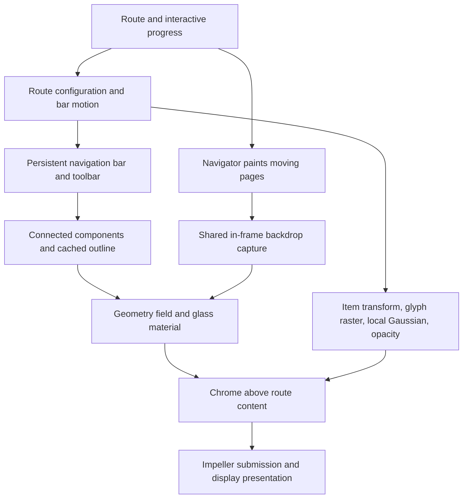

# Navigation transition audit

2026-10-09. Companion to the two user research briefs, not an implementation
of their proposed architecture. Release experiments use Flutter beta
3.49.0-0.2.pre, framework `38ec981bad`, engine `774a767348`, Pixel 6a,
Impeller Vulkan, 1080 x 2400, DPR 2.625, 60 Hz. The installed stable SDK
was checked separately for the Flutter GPU pass-lifecycle crash; this round
does not repeat that experiment.

## Actual ownership and frame graph

Source-confirmed:

- `lib/src/widgets/navigation_stack.dart:182,212,294,357,363,386` keeps a
  stable Navigator and one pair of bars above it. Pages publish immutable
  route configurations. `:981,1029` returns body-only scaffolds for routes
  owned by that stack. The gallery Navigation detail pushes onto the same
  Navigator; it does not create another shell. A standalone scaffold is a
  separate, intentional fallback.
- `lib/src/widgets/chrome_group.dart` and the stack's `_barsBackdrop`
  share one `BackdropKey` across both bars. This is in-frame sharing, not a
  retained blurred image across frames. A moving route changes sampled
  pixels without changing bar layout.
- `lib/src/widgets/glass_renderer.dart` partitions shapes into local
  connected groups before fusing. `glass_outline.dart:827,830,857` already
  caches exact and translated outlines. Animated deformation still needs
  a new contour. Analytic GPU field rendering does not remove the CPU
  contour needed for silhouettes and shadows.
- `lib/src/widgets/glass_liquid_draw.dart:445,464` shades separate shapes
  together, but uses a distinct optical layer for each fused body. The
  second host for measured apart/dissolve behavior in `bar_items.dart`
  also has a distinct visual role. A shared source is not one final
  material filter for every group.
- `bar_items.dart:1436,1464,1473,1486` caches content widgets, uses an
  Android glyph raster while soft, then local Gaussian, scale and opacity.
  `navigation_bar.dart` filters the inline title separately. Foreground
  glyph blur is not another backdrop capture. At rest small/no blur is
  omitted. Removing all these filters would change measured motion.
- `MorphGlyphRaster` captures its own child, not the engine's already
  presented framebuffer. Owned-background GPU experiments have the same
  source-acquisition distinction for arbitrary route content.

UI work includes configuration matching, motion evaluation, widget layout,
contours and Flutter GPU recording. Raster work includes layer composition,
native filter encoding, render-target management and submission. GPU work
includes backdrop filtering, optical material and foreground filters.
FrameTiming raster duration, GPU active work and presentation latency are
different quantities; they cannot be added as sequential stopwatch stages.

## Research brief hypotheses against current code

| Hypothesis | Current evidence | Next useful experiment |
|---|---|---|
| H1 persistent chrome | Already implemented; shared routes render body only | Ownership and cancellation regression coverage, not a second shell |
| H2 local union topology | Connected components and outline caches exist | Batch compatible optical draws and dirty only changed groups |
| H3 mask metaballs | Not implemented; would add blur/threshold passes | Geometry-only lab with measured bridge and edge reference |
| H4 independent foreground | Already separated; glyph raster exists | Reduce local source size; then compatible foreground draw/filter batching |
| H5 avoid layout storms | Stable Navigator/content caches exist; per-frame bar work remains | Count actual layout/paint and contour work under interactive retarget |
| H6 route snapshots | Owned-source lab exists, real sliding Navigation not qualified | Explicit source revision, reveal/halo and acquisition-cost test |
| H7 filter topology | New release census finds up to ten glyph filters | Reduce native filter/pass count, not just widget count |
| H8 grouped Gaussian | Preserved as control; one capture key in this fixture | Separate shared acquisition from material/filter submissions |
| H9 GPU lifecycle | Stable and beta reproduced Vulkan crash with dependent passes in one buffer | Single-pass draw batching or upstream lifecycle fix; no unsafe batching |

## What this round observes

The stage bench now records release-safe liquid render objects, capture-key
identities, foreground source boxes and the retained composed Layer tree at
frozen screenshot phases. Collection happens outside measured windows.
The old debug-only glass inspector returns zero in release and is not used
to establish these counts.

In the liquid Navigation fixture, phases 4 and 10 of nested push/pop have
ten mounted foreground filters and ten retained `ImageFilterLayer`s;
enter has three, toolbar four. There are two or three visible liquid
render layers, with one capture key. These are Flutter graph counts,
not ten measured native GPU passes or allocation sizes. Offstage and
zero-opacity branches are excluded; arbitrary custom culling is not
fully modeled. Capture-key identity does not count actual capture executions.

All 28 sampled control snapshots report liquid `blurPassSigma == 0`.
`liquid_glass_layer.dart:1606` therefore omits the separate Gaussian
backdrop pass in those states. The optical shader and its backdrop
acquisition remain; small softening inside that shader is a separate
possibility. This is not proof about every unobserved frame or other
frosted widgets, but it makes replacing the backdrop Gaussian a poor
first explanation for these Navigation transitions.

The control GPU launch's medians of three action repeats are:

| Action | UI p95 ms | Raster p95 ms | GPU active ms/frame |
|---|---:|---:|---:|
| Enter | 5.85 | 12.52 | 5.108 |
| Nested push | 9.40 | 19.84 | 6.299 |
| Nested pop | 7.80 | 17.00 | 5.563 |
| Toolbar | 3.51 | 13.89 | 4.389 |

Both sides use direct field and benchmark performance hints, with the live
glyph path; this is a research control, not default gallery cost. These are
warmed release transitions, not cold launch or a 120 Hz claim.
The 60 Hz deadline is 16.67 ms; push still misses it on raster and has
limited UI headroom. Prior release CPU stack sampling also finds substantial
`QueueVK::Submit`, command-buffer creation and allocation work. Sample
counts are not durations or exclusive attribution. Evidence supports a
topology/submission problem in addition to pixel arithmetic, but not an
exact fraction of time assignable to each component.

## Isolated bounded-glyph experiment

`MORPH_BAR_GLYPH_BOUNDS=true` makes ordinary glyph sources intrinsic-size
and back-label sources vertically intrinsic-size. An outer center preserves
the item box and its hit target. It leaves kernel, sigma, physics, source
content, tint, opacity and glass unchanged. The flag is off by default.

For nested push/pop phases with filters, source-box area changes from
16143 to about 6171 logical square pixels (62% lower); toolbar 6871 to
2504, enter 7724 to 3759. Filter count stays unchanged. These are not
measured GPU attachment sizes: Impeller can already crop painted coverage.
Results, native image checks and actual presentation comparisons are in
`tool/audit/codex-navigation-transition-report.md` and its raw archive.

## Next priorities

1. Prototype one local foreground drawing surface per compatible blur
   cohort. Preserve per-item scale, paint order and semantics, and classify
   cohorts using actual sigma/transform state. Two overlapping glyphs with
   different sigma cannot just share one Gaussian. Measure capture cost,
   native submission count and actual display cadence before adoption.
2. Try one optical material draw for multiple compatible disconnected
   components. Preserve apart/dissolve semantics, overlap order and local
   ROI; do not grow a sparse screen-wide union to save a layer. This attacks
   the repeated material/driver work that source sharing does not remove.
3. Instrument bar layout and contour cache misses under pause, reverse,
   cancellation and rapid push/pop. Move geometry work ahead only where
   inputs and invalidation are exact. Keep the measured physics contract.
4. Qualify owned backdrop reuse only for an explicitly cooperative source
   with revisions, damage coverage and a live fallback. A sliding page and
   a glass sibling are not fixed images whose blurs can always be mixed.

Admission requires repeatable Navigation presentation improvement, not a
smaller source box or faster isolated kernel. This round does not qualify
120 Hz, Metal performance, long translated/emoji content, 200% text scale,
interactive gesture cancellation or nested modal/hero composition for a
new production renderer. Existing motion tests remain relevant but do not
substitute for this native integration matrix.
